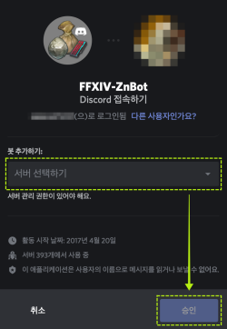
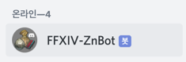

  

## 설치 방법
1. 아래의 [개인정보 처리방침](#개인정보처리방침) 을 반드시 읽어주세요. 이에 동의하지 않는 경우 FFXIV-ZnBot을 설치하시면 안 됩니다.
2. [디스코드 봇 추가 링크(클릭)](https://discordapp.com/oauth2/authorize?&client_id=304548617061007360&scope=bot&permissions=0) 에 접속합니다.

3. 봇을 등록할 서버를 선택합니다.
4. 승인 후, 해당 서버의 접속 중인 유저 리스트에 FFXIV-ZnBot이 나타났는지 확인합니다.

---
## 문의하기 / 버그 제보
- 이메일: admin( @ )znzinc( . )net
- 문의 접수 폼: [https://goo.gl/forms/2gAWYcKMTARLpyAG2](https://goo.gl/forms/2gAWYcKMTARLpyAG2)
- 트위터 (공지사항도 같이 전달드리고 있습니다): [https://twitter.com/FFXIV_ZnBot](https://twitter.com/FFXIV_ZnBot)

---

## <a name="개인정보처리방침">개인정보 처리방침</a> (마지막 개정일: 2020년 8월 2일)
1. **개인정보의 처리 목적**
- <FFXIV-ZnBot> (이하 '봇') 은 아래의 목적을 위하여 개인정보를 처리합니다. 처리하고 있는 개인정보는 다음의 목적 이외의 용도로는 이용되지 않으며, 이용 목적이 변경되는 경우에는 개인정보 보호법 제18조에 따라 별도의 동의를 받는 등 필요한 조치를 이행할 예정입니다. 
- 서비스 제공
  + '봇' 에서 제공하는 모든 서비스는 유저가 입력한 정보와 Discord의 개발자 도구를 통하여 전달받은 유저 정보를 바탕으로 이루어집니다. 이 서비스를 제공하는 목적으로 개인정보를 처리합니다.
- 오류 수정 및 기능 개선
  + '봇' 에서 수집한 개인정보 중 사용자의 입력 내역을 바탕으로 발생한 오류를 수정하며, 기능 개선을 위해 봇에게 전달된 메시지들을 참고하기 위하여 수집한 개인정보를 처리합니다.
- 고충처리
  + 민원인의 신원 확인, 민원사항 확인, 사실조사를 위한 연락, 통지, 처리결과 통보 등의 목적으로 개인정보를 처리합니다.

2. **수집하는 개인정보의 종류**
- **[필수]** '봇'이 접속했던 서버의 고유식별정보1, '봇'이 채팅을 수신했던 서버 내 채널의 고유식별정보1, '봇'에게 명령어를 전송한 유저의 고유식별정보1, '봇'이 참가중인 채널의 채팅 내용
  + 1 고유식별정보: '봇'이 개발하는 데 사용한 [discord.py](https://discordpy.readthedocs.io) 의 API 시스템 상 제공받는 정보 일체를 뜻합니다. 서버, 채널, 유저 등 종류에 따라 정보의 구성은 조금씩 다를 수 있으나, 공통적으로 표시되는 이름과 고유 ID를 포함합니다.
- **[선택]** 유저의 이름, 유저의 이메일, 유저가 문의사항 접수를 위해 첨부판 각종 파일과 내용
  + 선택 정보는 일반적으로 '봇' 을 사용할 떄는 수집하지 않으며, 사용자가 문의/지원 등을 위하여 메일 등의 수단으로 문의사항을 전달할 때만 수집합니다.

3. **수집한 개인정보의 사용**
- **[필수]** '봇'이 접속했던 서버의 고유식별정보, '봇'이 채팅을 수신했던 서버 내 채널의 고유식별정보, '봇'에게 명령어를 내린 전송한 유저의 고유식별정보, '봇'이 참가중인 채널의 채팅 내용
  + 봇에게 명령을 내리는 채팅에 한해서 파일로 저장합니다.
  + 오류 해결 및 기능 개선을 위한 테스트 시 개발자가 '봇'에게 수신되는 모든 메시지를 열람할 수는 있으나, 위에서 언급한 명령을 내리는 채팅이 아니라면 파일의 형태로 저장하지 않습니다.
  + 오류 분석용 도구(sentry.io)에 자동으로 전송됩니다. Sentry는 봇 내부에서 오류가 발생했을 때 자동으로 이를 기록해주는 시스템이며, 오류가 발생했을 때의 상황을 위에서 언급한 개인정보를 포함하여 전체적으로 저장합니다. '봇' 은 Sentry 에 저장된 내용을 봇의 오류 해결 및 기능 개선을 위해서만 사용합니다. Sentry에 전송된 정보는 [Sentry의 개인정보보호방침](https://sentry.io/privacy/)을 따릅니다.
- **[선택]** 유저의 이름, 유저의 이메일, 유저가 문의사항 접수를 위해 첨부판 각종 파일과 내용
  + 유저가 문의 및 오류 제보 등을 하기 위해 이메일을 보내거나, Google Form을 통해 문의사항을 전송하기 위해서는 위의 정보를 필수로 요구합니다. 어느 수단으로 문의사항 및 오류제보를 하더라도 위의 정보는 저장됩니다.

4. **정보주체와 법정대리인의 권리·의무 및 그 행사방법**
- '봇'의 사용자는 개인정보주체로서 다음과 같은 권리를 행사할 수 있습니다. 
  + 개인정보 열람요구, 삭제 요구, 개인정보 처리 정지 요구
  + 아래의 개인정보 보호책임자에게 연락하여 요구할 수 있습니다.

5. **개인정보의 파기**
- '봇'은 원칙적으로 개인정보 처리목적이 달성된 경우에는 지체없이 해당 개인정보를 파기합니다. 파기의 절차, 기한 및 방법은 다음과 같습니다.
- 파기절차
  + 이용자가 입력한 정보는 목적 달성 후 내부 방침 및 기타 관련 법령에 따라 일정기간 저장된 후 혹은 즉시 파기됩니다. 이 때, 저장되어 있는 개인정보는 법률에 의한 경우가 아니고서는 다른 목적으로 이용되지 않습니다. 정보 파기는 복구 불가능한 방법으로 이루어집니다.
- 파기기한
  + 이용자의 개인정보는 내부 방침에 따른 일정 기간동안 보관되며, 이 보유 기간이 경과된 경우에는 보유기간의 종료일로부터 5일 이내에, 개인정보의 처리 목적 달성, 해당 서비스의 폐지 등 그 개인정보가 불필요하게 되었을 때에는 개인정보의 처리가 불필요한 것으로 인정되는 날로부터 5일 이내에 그 개인정보를 파기합니다.
  + 이용자가 본인의 개인정보의 삭제를 요구하는 경우, 내부 방침에 따라 일정 기간 안에 이를 처리하고 요구자에게 통보합니다.

6. **개인정보 보호책임자 연락처**
- 이메일: admin(@)znzinc(.)net
- 트위터: [https://twitter.com/FFXIV_ZnBot](https://twitter.com/FFXIV_ZnBot)
- 혹은 [문의하기 링크](https://goo.gl/forms/2gAWYcKMTARLpyAG2)를 통해 문의하실 수 있습니다.

7. **본 약관의 적용 범위**
- 어떠한 방법으로든 봇을 서버에 초대하는 행위는 해당 서버의 모든 이용자가 정보 수집에 동의한 것으로 간주됩니다.
- '봇'은 서버에 참여한 이상 작동 특성상 채팅 데이터 등을 수집할 가능성이 있으므로, 본 약관에 동의하지 않는 경우 직접 '봇'을 탈퇴시켜야 합니다.

기재되어있는 회사 명 · 제품명 · 시스템 이름은 해당 소유자의 상표 또는 등록 상표입니다.
(C) 2010 - 2020 SQUARE ENIX CO., LTD. All Rights Reserved. Published in Korea by ACTOZSOFT CO., LTD.
